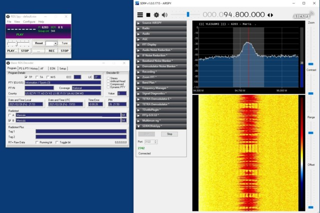

# SDRSharp RDS Output
> SDR# plugin for sending RDS data to RDS Spy with TCP, without the normal required Virtual Audio Cable and MPX Output setup.

SDR# RDS Output was created as a way for it to be easier to integrate with RDS Spy. I was tired of it being so difficult to get RDS Spy data from SDR#,
so I decided to code a plugin to be able to use RDS Spy with just simply a local network connection. This can be used without difficult to get working
virtual audio cables and can be rather easily controlled and customized to allow for better integration. This was originally supposed to be a private plugin
but it was made public to allow for individuals to contribute and maintain the project.



## Installation

Windows:

1) Drag and drop the DLL files from the [latest release](https://github.com/RadarFolf/RDSOutput/releases) into your SDR# directory.

2) Add the following line to your Plugins.xml file.

```sh
<add key="Rdsi" value="SDRSharp.RdsiPlugin.RdsiPlugin,SDRSharp.RdsiPlugin"/>
```

3) Launch SDR# and enable RDS Output.

## Release History

* 0.2.1
    * CHANGE: Update docs (plugin code remains unchanged)
* 0.2.0
    * FIX: Bugs and stability improvements.
* 0.1.1
    * FIX: Random crashes when using RDS Output.
* 0.1.0
    * The first proper release
* 0.0.1
    * Work in progress

## Meta

Casey Maxwell – [@RadarFolf](https://twitter.com/RadarFolf) – radar@caseymediallc.com

Distributed under the Apache license. See ``LICENSE`` for more information.

[https://github.com/RadarFolf/RDSOutput](https://github.com/RadarFolf)

## Contributing

1. Fork it (<https://github.com/RadarFolf/RDSOutput/fork>)
2. Create your feature branch (`git checkout -b feature/rdsoutput`)
3. Commit your changes (`git commit -am 'Add some feature'`)
4. Push to the branch (`git push origin feature/rdsoutput`)
5. Create a new Pull Request

<!-- Markdown link & img dfn's -->
[wiki]: https://github.com/RadarFolf/RDSOutput/wiki
